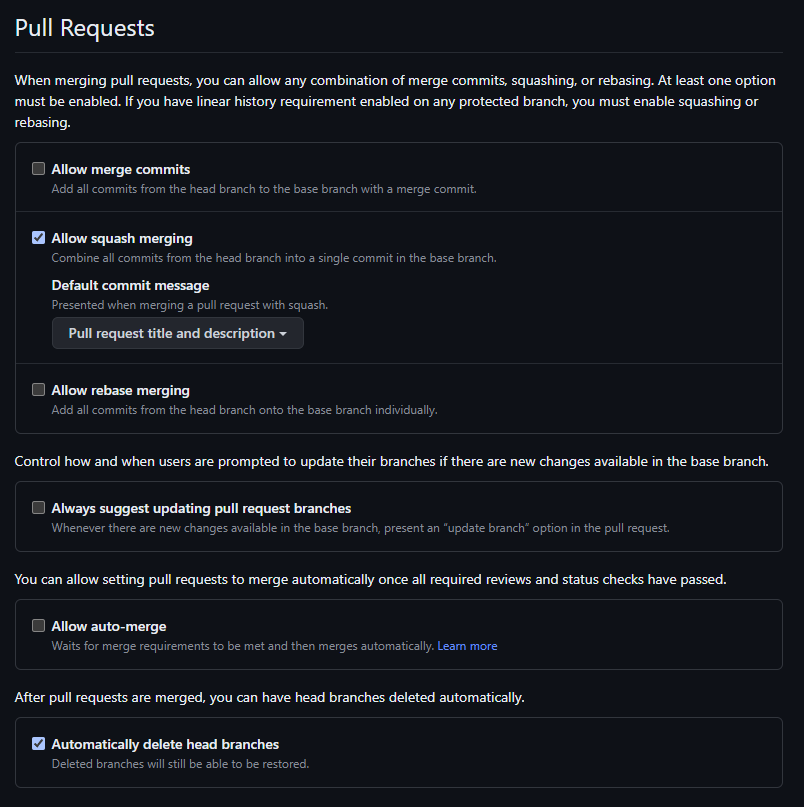
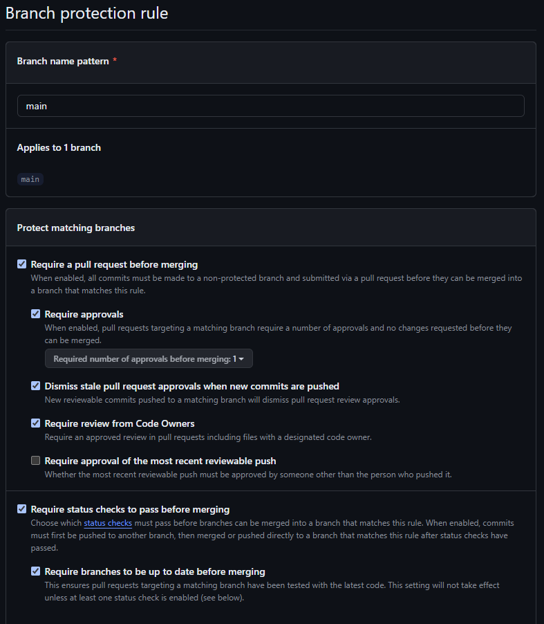
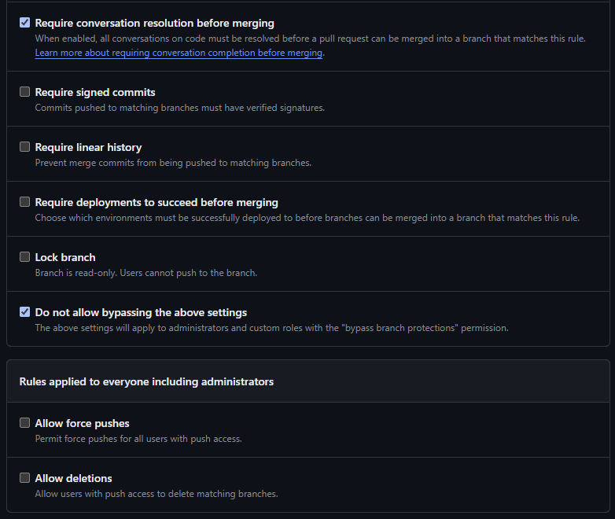

# Github Workshop

- Github: Lag et nytt repository under din private github bruker. Huk av for readme fil, repoet bør være public.
- Lokalt: Klone repo lokalt under pathen c:\git-workshop
- Lokalt: Lage en enkel commit på main branch og forsøk git push for å se at alt virker
- Github: Gå til settings og endre på [pull request settings](#general-settings---pull-requests).
- Github: Sett opp [branch protection](#branch-protection) for main branch
- Lokalt: Lag en ny commit på main branch og forsøk git push. Skal nå feile.
- Lokalt: Undo commit. `git reset HEAD~1`
- Lokalt: Lag en ny feature branch bruk gjerne feat/ chore/ som prefix
- Lokalt: Commit en endring til feature branch
- Lokalt: Push til github
- Github: Lag en pr basert på feature branch i github. Sjekk at den krever approval.
- Github: Lag en issue. Prøv så å link denne ved å bruke #{id på issue} i description av pr.
- Github: Utfør en code review. (Tips: er mulig å klikke . for å åpne vscode online)
- Github: Godkjenn endringen og merge pull request
- Github: Se på hvordan du kan sette opp en [CODEOWNERS](https://docs.github.com/en/repositories/managing-your-repositorys-settings-and-features/customizing-your-repository/about-code-owners) fil
- Github: Se på hvordan du kan lage en [pull request template](https://docs.github.com/en/communities/using-templates-to-encourage-useful-issues-and-pull-requests/about-issue-and-pull-request-templates#pull-request-templates)
- Github: Se på hvordan du kan lage [issue templates](https://docs.github.com/en/communities/using-templates-to-encourage-useful-issues-and-pull-requests/about-issue-and-pull-request-templates#issue-templates)

## Repository settings

### General settings - Pull Requests

### Branch protection

